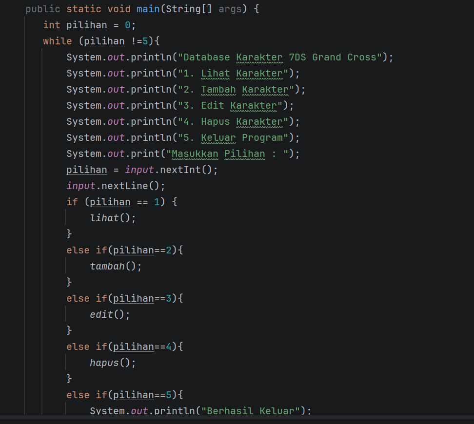
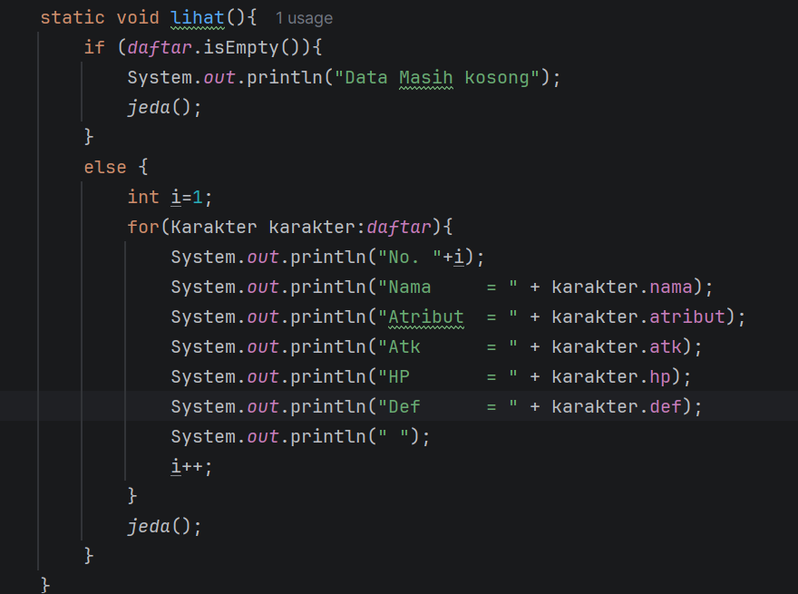
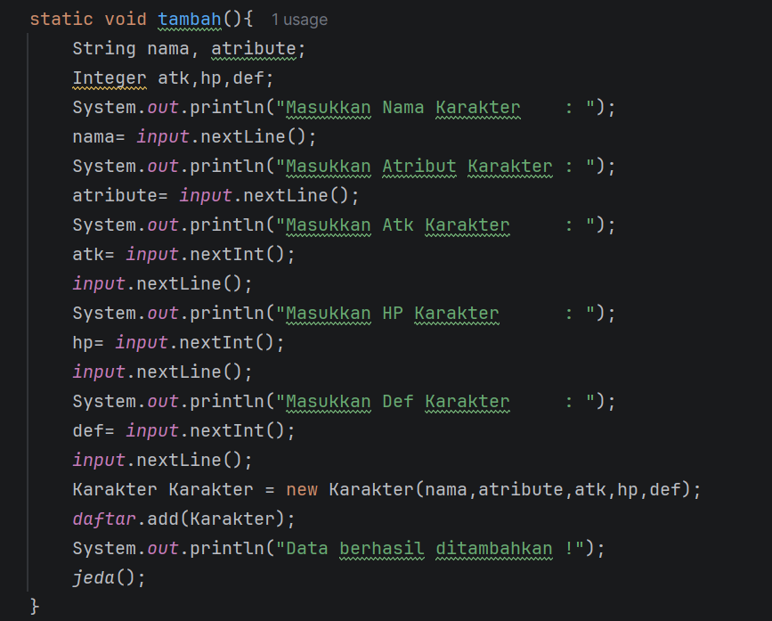
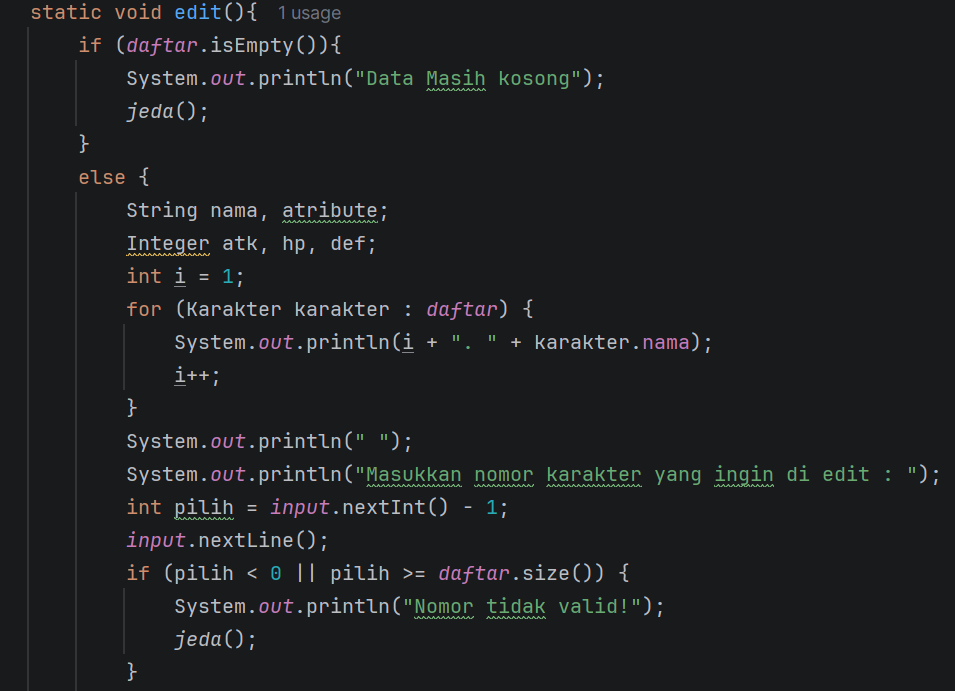
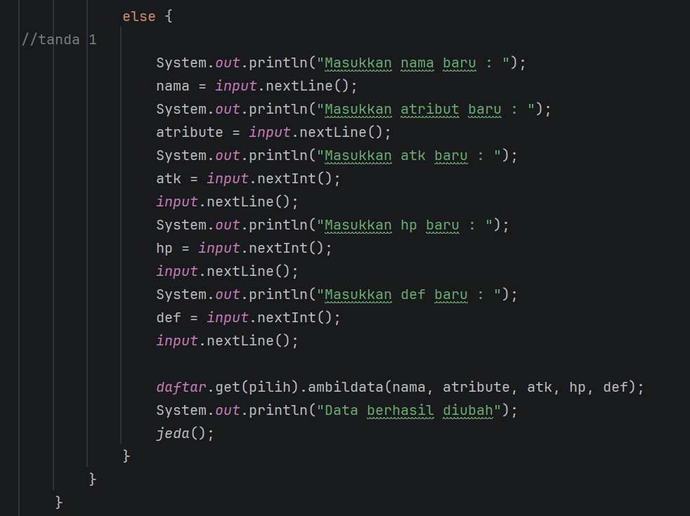
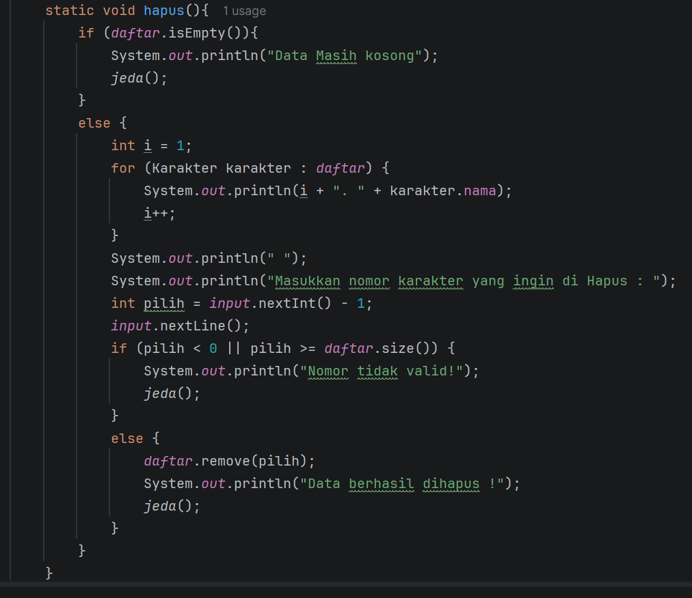

#laporan Posttes-1
Muhammad Husein Permadi
2409106051
B1-24
Matkul PBO
## Deskripsi program
    Program ini adalah program crud untuk database karakter 7dsg dimana kita bisa melihat , menambah , mengedit, dan menghapus karakter.
    Program ini menggunakan 2 class yang dimana terdapat class main dan juga class karakter

## Main

ini adalah program dari menu utama yang menggunakan if else untuk memilih menu.

## Lihat data

ini adalah program dari menu lihat yang menggunakan perulangan untuk menampilkan seluruh datanya

## tambah data

ini adalah program dari menu tambah dimana saat kiita selesai menginput data maka program akan menambahkan data yang kita input ke databasenya

## ubah data

ini adalah program dari menu ubah yang digunakan untuk mengubah data dari data yang telah ditambahkan

## hapus data

ini adalah program dari menu hapus untuk menghapus data yang sudah ada.