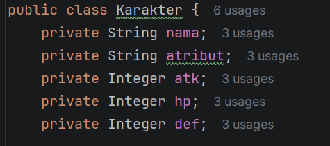
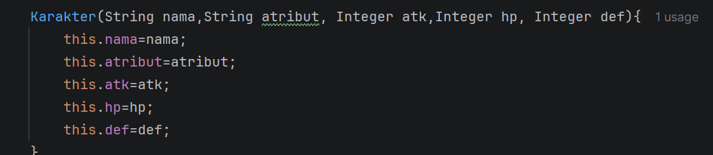
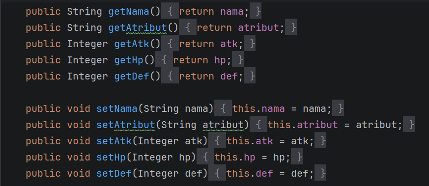
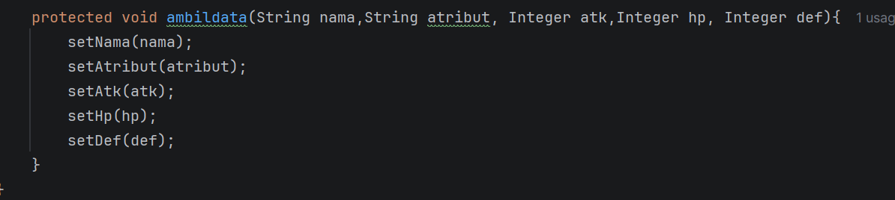
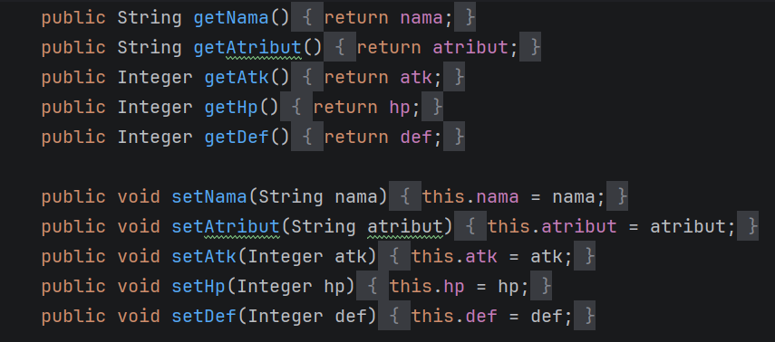
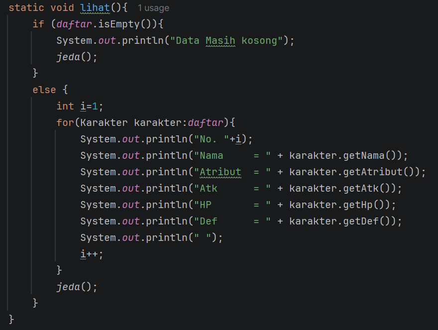
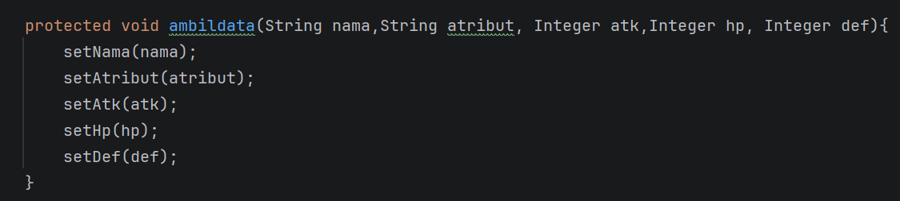
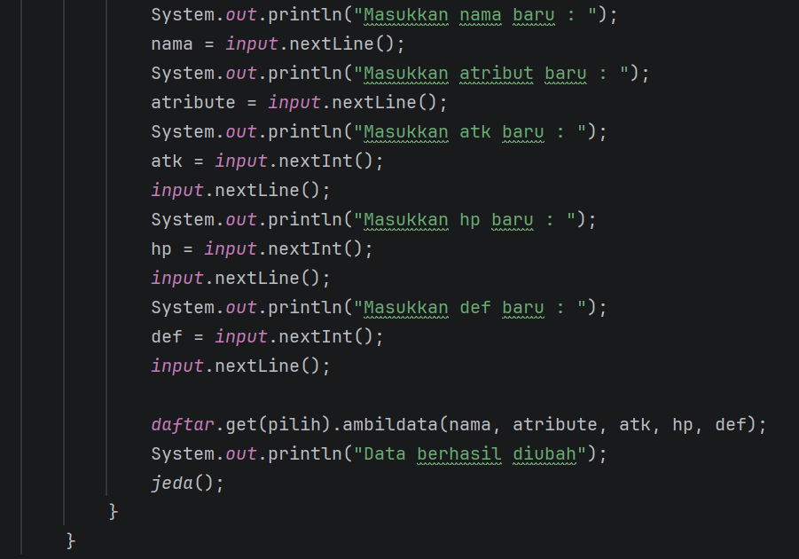

#laporan Posttes-2
Muhammad Husein Permadi
2409106051
B1-24
Praktikum PBO
# pt1
## Deskripsi program
    Program ini adalah program crud untuk database karakter 7dsg dimana kita bisa melihat , menambah , mengedit, dan menghapus karakter.
    Program ini menggunakan 2 class yang dimana terdapat class main dan juga class karakter

## Main

ini adalah program dari menu utama yang menggunakan if else untuk memilih menu.

## Lihat data

ini adalah program dari menu lihat yang menggunakan perulangan untuk menampilkan seluruh datanya

## tambah data

ini adalah program dari menu tambah dimana saat kiita selesai menginput data maka program akan menambahkan data yang kita input ke databasenya

## ubah data

ini adalah program dari menu ubah yang digunakan untuk mengubah data dari data yang telah ditambahkan

## hapus data

ini adalah program dari menu hapus untuk menghapus data yang sudah ada.

# pt2
## private class modifire

private adalah class modifier paling ketat dimana dia hanya bisa di akses oleh class uang sama

## default class modifier

default adalah access modifier dimana penguna tidak mencantumkan accessmodifier apapun , access modifier ini hanya bisa di akses di class dan package yang sama

## Public class modifier

public adalah access modifier paling bebas karena dapat di akses dimanapun getter dan setter menggunakan class ini agar dapat diakses di package lain.

## proctected class modifier

protected adalah access yang hanya melarang penggunaan di package yang berbeda

## getter & setter

getter digunakan untuk mengambil data, pada program ini digunakan untuk melihat data, sehingga program pada lihat data berubah menjadi 

setter digunakan untuk mengubah data sehingga pada program ini kodenya berubah menjadi seperti ini

dan di program utamanya digunakan pada menu edit
